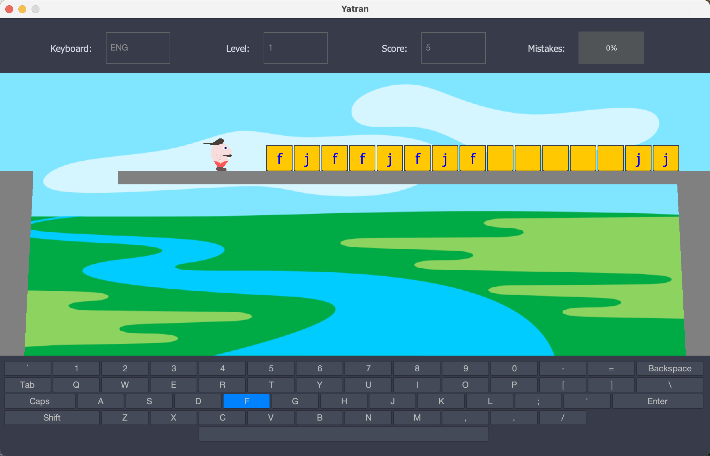

# Meom

### Project description

Meom - is a programming tutor for children that allows improving logical thinking and get programming skills in a
playful way.

The application is named after the popular
sometime ["MEOM"](https://en.wikipedia.org/wiki/MESM),
which was manufactured at the Ukrainian "Drukmash" plant in the second half of the 20th century.

### Player requirements

The application requires the user to type at a speed that more than 200 symbols per minute (40 words per minute) and
allows 10% of mistakes to make. The difficulty of the gameplay could be configured by a level selection (a higher level
means more variety of characters in the level).

### Localization

To add a localization:

1. Create a `*.properties` file with translated item names. Make sure the file has the next format name - `Locale_
   {language}_{COUNTRY}.properties`;
2. Put the file in the `src/main/resources/` folder;
3. Add a new variable in the `src/main/java/ua/com/meom/enums/Meom.java` file with the appropriate information.
   Note that the `Locale` parameters should be the same with the `{language}` and `{COUNTRY}` values.

### Application building

To build the application by yourself, you need to do the next steps:

**Note:** according to
the [JPackage documentation](https://docs.oracle.com/en/java/javase/14/docs/specs/man/jpackage.html) we can build the
application for a platform ONLY under the target platform!

1. Install and add to the PATH [Java](https://www.oracle.com/java/technologies/downloads/) (JDK version 14+);
2. Install packaging tools according to the target operating system:
    - RPM, DEB on Linux: On Red Hat Linux, we need the rpm-build package, on Ubuntu Linux, we need the fakeroot package;
    - PKG, DMG on macOS: Xcode command line tools are required when the `–mac-sign` option is used to request that the
      package be signed, and when the `–icon` option is used to customize the DMG image;
    - EXE, MSI on Windows: On Windows, we need the third party tool [WiX 3.0](https://wixtoolset.org/docs/wix3/) or
      later
3. Download the project to the target machine;
4. Under the project folder, execute the next command in the console to create a JAR file:

   `mvn clean package`
5. After the JAR file was created, execute the next command in the console to create an installation file (Windows OS
   example):

   `jpackage --input target/ --dest target/ --name Meom --app-version 1.0.0 --description 'Programming tutor for children that allows improving logical thinking and get programming skills in a playful way' --icon src/main/resources/images/icon.ico --main-jar Meom-1.0.0-jar-with-dependencies.jar --main-class ua.com.meom.Meom --type exe --win-dir-chooser --win-menu --win-per-user-install --win-shortcut`
6. After the command is executed, you will be able to find the installation file in the `target` folder.

---
This is a Java (Swing)-based open source application under the GNU GPL v.3 license.

